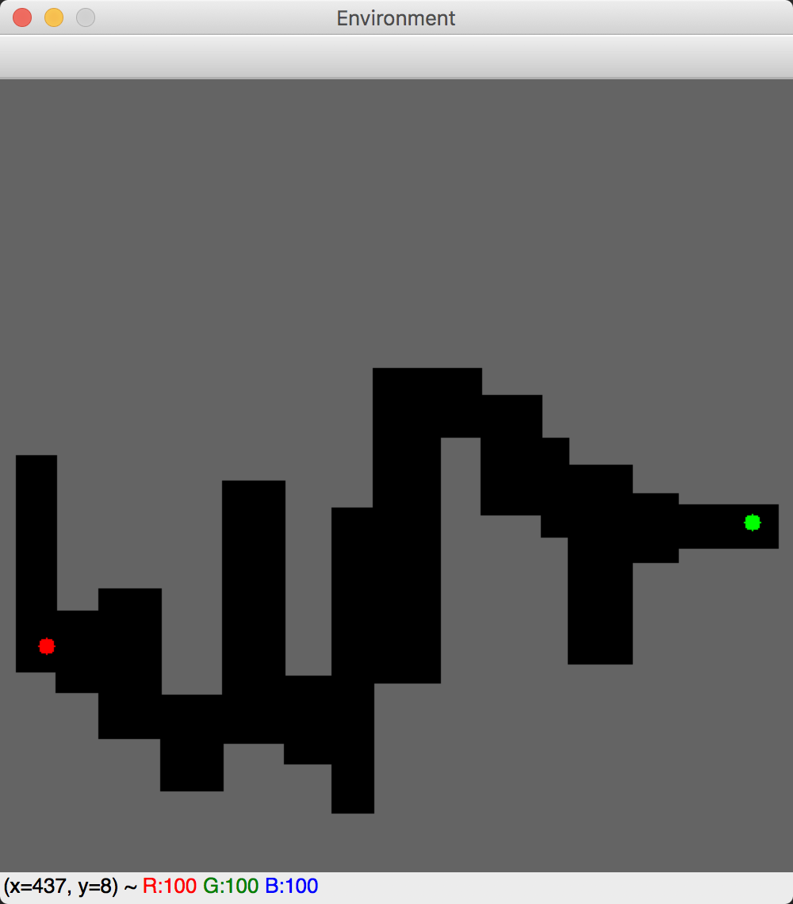
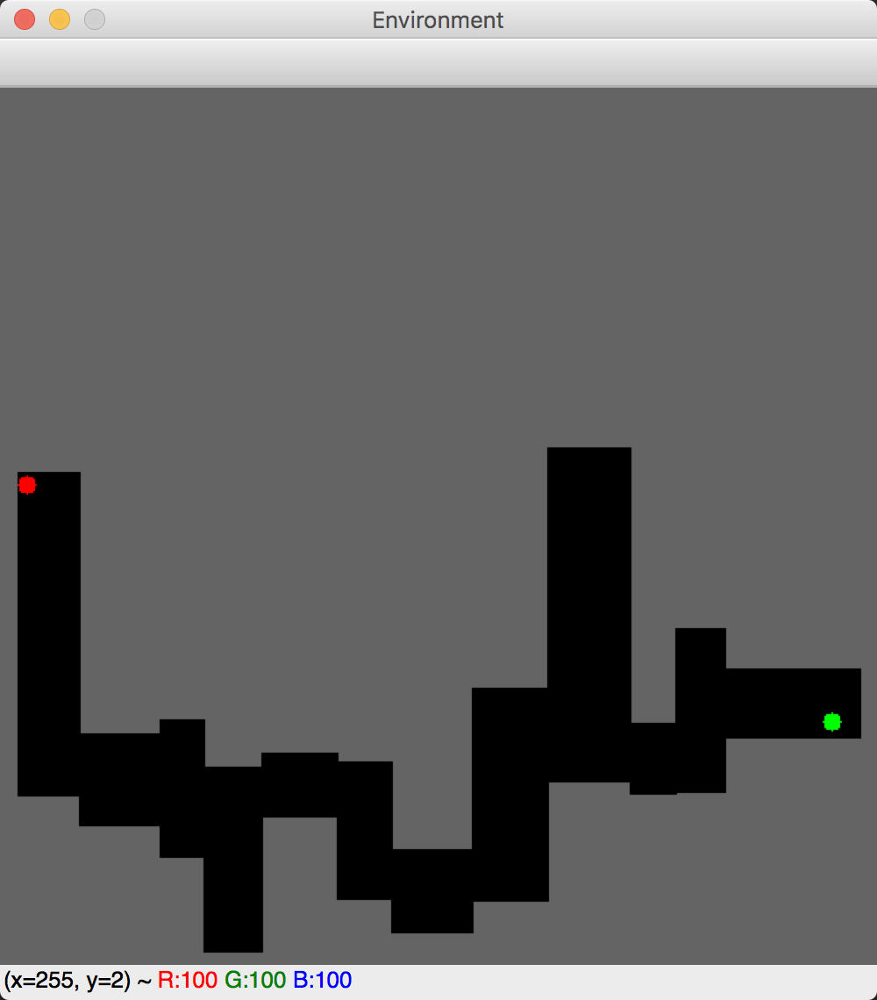
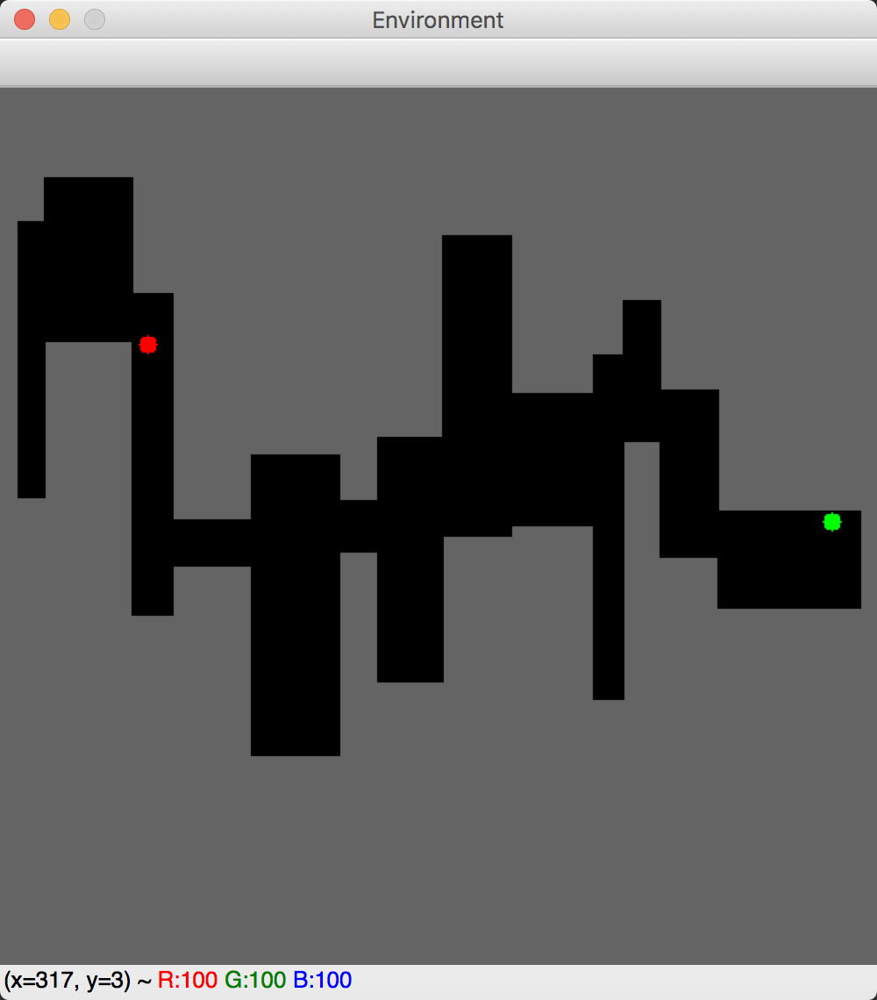

# RL-DQN-maze: DQN for learning policies for an agent to get out of a random maze

| | | |
|:-------------------------:|:-------------------------:|:-------------------------:|
| Random env 1| Random env 2| Random env 3|

The goal is for an agent (green dot) to learn a policy to get the end of the maze (red dot). Different approaches are explored, based on a [DQN](https://www.cs.toronto.edu/~vmnih/docs/dqn.pdf
) architecture. Discrete (4 directions Up-Left-Bottom-Top) and continuous (360 degree range angles) space actions are implemented as well as other RL ideas such as replay buffer, prioritised replay buffer.

Credits
-------

This is part of the CO424 - Part II coursework project (MSc in AI, Imperial College). The code for generating the environment (random_environment.py) was provided by Dr Edward Johns for the CW. The agent implementations are original.
